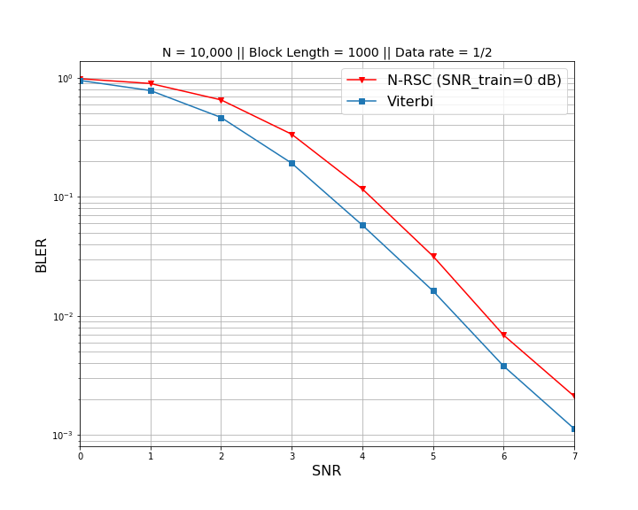

# THIS IS NOT AN OFFICIAL IMPLEMENTATION

This repository is an implmentation of "*Communication Algorithms via Deep Learning*". Paper: https://arxiv.org/abs/1805.09317.

This paper claims that a Recurrent Neural Network can **learn from data to decode** noisy coded signal over Additive White Gaussian Noise (AWGN) Channel **as good as** Viterbi and BCJR algorithm. 

Block Length = 1000         |  Block Length = 1000 
:-------------------------:|:-------------------------:
| 

## Network Architecture:

[IMAGE]

* **Why Bi-directional, and not uni-directional, RNN?** Similar to dynamic programming, it usually consists of a forward and backward steps. The Bi-directional RNN architecture allows the network to learn the feature representation in both ways.

* **Proper training data matters.** In addition, the paper provides an emperical method to determine the Signal-to-Noise (SNR) for generating training dataset. It helps the network generalize better during testing. Given message bit sequence $K$, transmitted codeword sequence of length $c$ and data rate $r$. Then, $SNR_{train}$ is computed as:
$$SNR_{train}=min\{SNR_{test}, 10log_{10}(2^{2r} - 1)\}\space\space \text{(Appendix D)}$$ 

* For example, the paper uses $r=1/2$ and block length $c=2K$. Then $SNR_{train} =min(SNR_{test}, 0)$.

## Example
* I have written a notebook to train a Neural Decoder and compare with the Viterbi Decoder (using CommPy library).

## Reproduce the result - Step by Step

## Result
---
This repository validates that, indeed, an RNN can learn to decode convolution coded signals over AWGN Channel. Moreover, this RNN can generalize well to decode at different Signal To Noise (SNR) values as good as Viterbi Algorithm Decoder. We use `Bit Error Rate` (BER) and `Block Error Rate` (BLER) as two metrics for benchmarking the performance.

